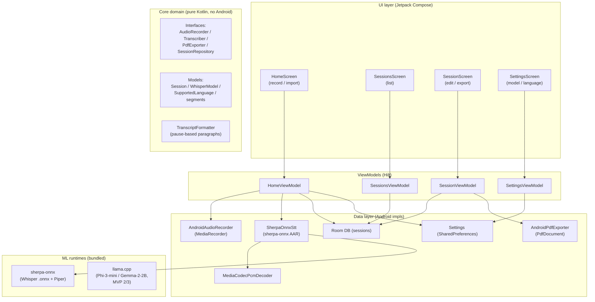
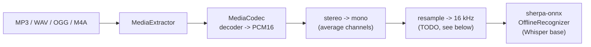

# Architecture

## 1. Big picture

Voice to PDF is a **single-APK, offline-first Android app**. All heavy work
happens on-device: audio capture, PCM decoding, speech inference
(sherpa-onnx), LLM planning (MVP 2/3), and PDF rendering. The architecture is
deliberately boring — small, layered, and easy to test — because the hard
problems here are *performance on 4 GB devices* and *native integration*, not
architectural novelty.



## 2. Layer rules

- **`core/` must not depend on Android.** It holds interfaces, models, and pure
  functions. This is what makes the paragraph-break logic (F7) unit-testable on
  the JVM (`TranscriptFormatterTest`).
- **`data/` depends on `core/`** and implements its interfaces using Android
  APIs.
- **`ui/` depends on `core/` and `data/`** through ViewModels. Screens never
  touch Room or MediaCodec directly.
- **Hilt** (`di/`) wires interfaces to implementations, so tests can swap in
  fakes.

Dependency direction is always inward: `ui → data → core`.

## 3. Data flow — the MVP 1 happy path

```
1. Record          MediaRecorder -> cacheDir/rec_<ts>.m4a (AAC)
2. Stop            AudioRecorder.stop() -> durationMs + file
3. Persist         Session(TRANSCRIBING) inserted into Room
4. Decode          MediaCodecPcmDecoder -> 16 kHz mono ShortArray
5. Infer           sherpa-onnx OfflineRecognizer (Whisper base .onnx)
6. Store           Session(READY, transcript)
7. Edit            SessionScreen OutlinedTextField (draft)
8. Export          PdfExporter.export(request, contentUri) -> A4 PDF
9. Share/Print     ACTION_CREATE_DOCUMENT / ACTION_SEND (MVP 1 F6)
```

Transcription is **post-hoc** (never real-time): the user stops recording,
then waits. Progress is reported as `processedMs / totalMs`.

### Import path (F1)

`ACTION_OPEN_DOCUMENT` (Storage Access Framework) → the app copies the picked
file into `cacheDir` → the same transcribe pipeline runs. No storage
permission is needed because SAF grants per-file access.

## 4. Audio pipeline



- Our recorder already outputs 16 kHz mono AAC, so decode is a passthrough.
- Imported files may be 44.1 kHz stereo. Channel downmix is implemented;
  **sample-rate conversion to 16 kHz is a TODO** in `MediaCodecPcmDecoder`
  (it currently asserts the source is 16 kHz). The resampler is a
  self-contained ~50-line function (linear/SoX-style interpolation) and is the
  first natural implementation task.
- Whisper expects raw 16-bit little-endian mono PCM at 16 kHz.
- Speech runs on **sherpa-onnx** (Whisper `base` exported to ONNX) — see
  `docs/DECISIONS.md` ADR-009 and `ml/README.md`.

## 5. Storage schema

Room database `voicetopdf.db`, single table:

```
sessions
  id            INTEGER PRIMARY KEY AUTOINCREMENT
  title         TEXT
  createdAtEpochMs  INTEGER
  status        TEXT  ('TRANSCRIBING' | 'READY' | 'ERROR')
  transcript    TEXT NULL
  audioPath     TEXT NULL     -- only if user opted to keep audio
  durationMs    INTEGER
  language      TEXT  (enum name)
  model         TEXT  (enum name)
```

Room schema JSON is exported to `app/schemas/` (append-only — see
`ksp { arg("room.schemaLocation", ...) }` in `app/build.gradle.kts`).

> Storage rule from the PRD: transcripts are plain text; audio is retained
> only if the user opts in. MVP 1 keeps a `cacheDir` copy and prunes it once a
> session is READY.

## 6. Threading model

| Work | Thread | How |
|------|--------|-----|
| UI | Main | Compose |
| Recording | Main (MediaRecorder does its own I/O) | `AudioRecorder` |
| PCM decode | Background | `Dispatchers.Default` via `withContext` |
| Speech inference (sherpa-onnx) | Background, CPU | `Dispatchers.Default`; blocking native call |
| LLM planning (MVP 2/3) | Background, CPU | llama.cpp, loaded on demand |
| Room | Main-safe | Suspend DAO + Flow |
| PDF render + disk write | Background | `Dispatchers.IO` |

`Transcriber.transcribe` is a **blocking native call**; implementations must
hop off the main thread. ViewModels launch in `viewModelScope`.

## 7. Offline-first design

- No permissions for network. No HTTP client dependency at all in MVP 1.
- Model files live in `filesDir/models/`: Whisper/Piper `.onnx` for
  sherpa-onnx, GGUF for llama.cpp. MVP 1 bundles the speech models into the
  APK; larger LLM models (MVP 2/3) become a one-time optional download with a
  clear consent screen, then work offline (see `ml/README.md`).
- If the device has < 4 GB RAM at launch, show a "requires 4 GB" gate screen
  (risk mitigation). The MVP 3 agent additionally swaps Phi-3-mini for
  Gemma-2-2B and load/unloads the LLM on demand (see §10).

## 8. MVP 2 extension points (no re-architecture needed)

- `core/model/` already separates `Session` (MVP 1) from future `StructuredDoc`.
- A new `StructuringEngine` interface sits next to `Transcriber`, with two
  implementations (on-device llama.cpp, optional cloud) behind the same
  interface — matches the hybrid decision in `docs/PRD.md §5.5`.
- MVP 2 can ship as a **separate APK or in-app module**; the single `:app`
  module today is fine to start, and can be split into `:app`, `:core`,
  `:recognition`, `:pdf` feature modules later without touching domain code.
- **MVP 3 (voice agent)** is a further additive module: `:agent` with the
  AccessibilityService, the LLM planner, and the TTS bridge. It reuses
  `:core` interfaces (same `Transcriber` shape for STT) and Room for action
  logs. See §10.

## 9. Security & privacy

- Default path: **zero data leaves the device**.
- RECORD_AUDIO is the only runtime permission in MVP 1.
- Import/export use Storage Access Framework (scoped storage, no broad storage
  permission).
- The optional cloud "enhance" button (MVP 2) must show explicit "uses your
  data over the network" consent before any upload.
- The MVP 3 AccessibilityService is a sensitive, visible capability: it must
  be disclosed in-app, and every sensitive action (send message, call, open
  account) requires a per-action confirmation dialog (see PRD §7.5).

---

## 10. MVP 3 — voice agent (additive module)

The agent is a **separate module/APK** that hears a command, plans one action
with an on-device LLM, executes it through AccessibilityService, and confirms
by voice. It shares the speech runtime and Room from MVP 1 but is fully
optional — the app works without it.

### 10.1 Agent loop

```text
┌──────────────────────────────────────────────────────────────────────┐
│                        ANDROID APP (Kotlin)                          │
│                                                                      │
│  ┌─────────────┐     ┌──────────────────┐     ┌──────────────────┐  │
│  │  sherpa-onnx │     │   llama.cpp      │     │  Accessibility   │  │
│  │  (STT)      │────►│   (LLM planner)  │────►│  Service         │  │
│  │  Whisper     │     │   Phi-3-mini     │     │  (executor)      │  │
│  │  base .onnx  │     │   Q4, 3.8B      │     │  tap/scroll/type │  │
│  └──────┬──────┘     └────────┬─────────┘     └────────┬─────────┘  │
│         │                     │                         │            │
│         │              ┌──────▼───────┐                  │            │
│         │              │  Tool calls  │                  │            │
│         │              │  - tap(x,y)  │                  │            │
│         │              │  - type(str) │                  │            │
│         │              │  - scroll()  │                  │            │
│         │              │  - openApp() │                  │            │
│         │              └──────────────┘                  │            │
│         │                                                │            │
│         │         ┌──────────────────┐                   │            │
│         │         │  sherpa-onnx     │◄──────────────────┘            │
│         │         │  (TTS)           │   "Done. Email sent."          │
│         │         │  Piper .onnx     │                                │
│         │         └────────┬─────────┘                                │
│         │                  │                                          │
│         ▼                  ▼                                          │
│    [Microphone]        [Speaker]                                     │
└──────────────────────────────────────────────────────────────────────┘
```

### 10.2 Resource budget on a 4 GB RAM device

| Component | RAM | Notes |
|-----------|-----|-------|
| Android OS + system | ~1.2 GB | Baseline |
| sherpa-onnx STT (Whisper base) | ~200 MB | Loaded only during transcription |
| sherpa-onnx TTS (Piper) | ~150 MB | Loaded only during speech |
| llama.cpp (Phi-3-mini Q4) | ~2.5 GB | **Bottleneck** |
| App UI + AccessibilityService | ~150 MB | |
| **Total peak** | **~4.2 GB** | ⚠️ Tight — see mitigation |

**Mitigations (4 GB devices):** use Gemma-2-2B Q4 (~1.5 GB) → ~3.2 GB total;
load/unload the LLM on demand; load STT/TTS independently of the LLM; on
6 GB devices default to Phi-3-mini with Gemma-2-2B as the "low-RAM" option.

### 10.3 Key interfaces (sketch)

```text
interface VoiceAgent {
    suspend fun run(command: String): AgentResult   // plan -> confirm -> execute
}

interface ToolExecutor {          // implemented by the AccessibilityService
    suspend fun openApp(packageName: String): Result<Unit>
    suspend fun tap(x: Int, y: Int): Result<Unit>
    suspend fun typeText(text: String): Result<Unit>
    suspend fun scroll(direction: Direction): Result<Unit>
}

interface TtsEngine {             // Piper via sherpa-onnx
    suspend fun speak(text: String)
}
```

### 10.4 Hard boundary

The agent only performs UI actions (tap, type, scroll, open app). It does NOT
access contacts, read SMS content, or make phone calls without an explicit
per-action user confirmation dialog: "Agent wants to send message to X.
Allow?" — enforced in `VoiceAgent.run` before any privileged `ToolExecutor`
call.
