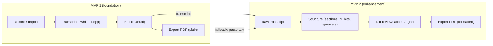
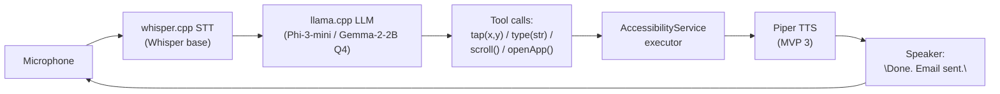

# Product Requirements Document — Voice to PDF

- **Product:** Voice to PDF (working title)
- **Platform:** Android, min API 26 (Android 8.0)
- **License:** MIT
- **Status:** MVP 1 in development (scaffold); MVP 2 specified but not started
- **Last updated:** 2026-09-08

---

## 1. Problem

Students in low-connectivity environments (e.g. African universities) cannot
quickly document lecture notes or presentation content. They rely on slow
handwriting, expensive typists, or unreliable internet for transcription. The
"last mile" — getting spoken words into a print-ready PDF — is broken.

## 2. Target user

- University student
- Android device, mid-range, **4 GB RAM minimum**
- Unreliable or no internet
- Needs to capture **30–90 minutes** of lecture/presentation content and print
  it **same-day**

## 3. Product principles

1. **100% offline.** Every P0 feature works in airplane mode.
2. **$0 for the user.** No ads, no in-app purchases, no accounts.
3. **Free to redistribute.** Open source under MIT.
4. **Respect low-end hardware.** Must run on 4 GB RAM, no GPU assumed.
5. **Privacy by default.** Nothing ever leaves the device in the default flow.

---

## 4. MVP 1 — Voice to PDF (foundation)

### 4.1 Scope — In

| #  | Requirement | Prio |
|----|-------------|------|
| F1 | Record audio in-app (mic input) or import from file (MP3/WAV/OGG) | P0 |
| F2 | Transcribe audio using a local Whisper model (tiny or base) | P0 |
| F3 | Display transcript with editable text field (user can fix errors) | P0 |
| F4 | Export transcript as a print-ready PDF (A4, 11 pt, 1.5 line spacing, header with title/date) | P0 |
| F5 | Save sessions locally (list of past recordings + transcripts) | P0 |
| F6 | Share PDF via Android intent (WhatsApp, email, print) | P1 |
| F7 | Basic text formatting in PDF: auto-paragraph breaks on pause > 2 s | P1 |
| F8 | Language selection (EN, FR, PT, Swahili, Arabic — top 5 by target region) | P1 |

### 4.2 Scope — Out (explicitly excluded from MVP 1)

- Cloud processing of any kind
- AI structuring / auto-sectioning
- Multi-speaker diarization
- Real-time transcription (transcription happens after recording stops)
- Sync, accounts, subscriptions
- iOS, tablet, desktop

### 4.3 Non-functional requirements (MVP 1)

| Requirement | Target |
|-------------|--------|
| Transcription speed | ≤ 1.5× real-time on 4 GB RAM device (30 min audio → ≤ 45 min processing) |
| APK size | ≤ 100 MB (bundled Whisper `base` GGML q8_0 ~78 MB) |
| Battery | ≤ 15% drain per 30-min recording + transcription session |
| Storage | Transcripts as plain text; audio retained only if user opts in |
| Offline | 100% of P0 features work in airplane mode |
| Cost to user | $0, no ads, no in-app purchases |
| Min Android | API 26 (Android 8.0) |

### 4.4 Success metrics (6 months post-launch)

- 5,000+ installs in target markets (Nigeria, Kenya, South Africa, Senegal, Ethiopia)
- ≥ 70% of sessions complete (record → transcribe → export PDF) without crash
- Play Store rating ≥ 4.2
- Zero revenue target (open-source or freemium with no paywall on core flow)

### 4.5 Risks & mitigations (MVP 1)

| Risk | Mitigation |
|------|------------|
| Whisper tiny accuracy poor on accented speech | Let user pick model size (tiny/base/small) with trade-off warning; ship base as default |
| Low-end devices (< 3 GB RAM) OOM | Detect RAM at launch; show "requires 4 GB" screen if below threshold |
| PDF formatting looks ugly | Keep layout minimal (single column, no fancy styling); test on 3 common printers |
| No funding for development | Open-source under MIT; seek university partnership for hosting CI/CD |

---

## 5. MVP 2 — AI-enhanced structuring (future)

### 5.1 Problem

Raw transcription is a wall of text. Students need structured,
presentation-ready documents: sections, sub-headings, bullet points, speaker
labels. Doing this manually defeats the purpose of voice capture.

### 5.2 Target user

Same as MVP 1, but with **intermittent connectivity** (can process 1–2× per day
when Wi-Fi is available) **or** a more capable device (6 GB+ RAM) for on-device
LLM.

### 5.3 Scope — In

| #  | Requirement | Prio |
|----|-------------|------|
| F1 | Accept a raw transcript (from MVP 1 or manual paste) | P0 |
| F2 | Auto-detect and insert section headings ("Introduction", "Main Points", "Conclusion") | P0 |
| F3 | Convert run-on sentences into bullet points where appropriate | P0 |
| F4 | Detect speaker changes (diarization) and label "Speaker 1 / Speaker 2" | P1 |
| F5 | Suggest a title for the document | P1 |
| F6 | "Polish" mode: fix grammar, remove filler words ("um", "like", "so basically") | P1 |
| F7 | User can accept/reject each structural change (diff view) before finalizing | P0 |
| F8 | Export structured PDF (same format as MVP 1, with heading hierarchy) | P0 |
| F9 | "Presentation mode": reformat as slide-style PDF (one section per page, larger font) | P2 |

### 5.4 Scope — Out

- Real-time structuring during recording (always post-hoc)
- Generating new content (summaries, flashcards, quiz questions) — separate idea, parked as a future milestone (not MVP 3)
- Multi-document projects / workspaces
- Collaboration / sharing of structured docs

### 5.5 Architecture decision: on-device vs cloud

The critical fork for MVP 2:

| Approach | Pros | Cons |
|----------|------|------|
| On-device LLM (Phi-3-mini 3.8B, Llama-3.2 1B, via MLC-LLM or llama.cpp) | Works offline, no cost, privacy | Requires 6+ GB RAM; slow (30–60 s/page); lower quality |
| Cloud API (user's own API key or free-tier provider) | Higher quality, faster, smaller app | Requires internet; potential cost; privacy concern |
| Hybrid (default on-device, optional cloud "enhance" button) | Best of both | More complex UX; two code paths to maintain |

**Decision: ship hybrid.** Default = on-device (Phi-3-mini or Llama-3.2 1B
quantized to Q4). Optional "Enhance with Cloud" button for users with
connectivity who want higher quality. No accounts, no mandatory API keys —
cloud is opt-in with a clearly labeled "uses your data over the network"
consent.

### 5.6 Structuring prompt (on-device)

> "You are a note-taker. Given raw lecture transcript text, restructure it
> into: a title, 3–7 section headings (## level), bullet points under each
> section. Preserve all factual content; do NOT add information not in the
> source. Output in Markdown."

Output is parsed, rendered as a diff against the raw transcript, and user
approves before PDF export.

### 5.7 Non-functional requirements (MVP 2)

| Requirement | Target |
|-------------|--------|
| Structuring latency (on-device) | ≤ 60 s for 2,000-word transcript on 6 GB RAM device |
| Structuring latency (cloud) | ≤ 10 s |
| Model size (on-device) | ≤ 2.5 GB (Q4 quantized) |
| Privacy | On-device: zero data leaves device. Cloud: data deleted after processing, no logging |
| Cost to user | Free (on-device). Cloud: free up to 5 docs/day, then $1/month or bring-your-own-key |

### 5.8 Success metrics (6 months post-launch)

- ≥ 40% of MVP 1 users upgrade to / use MVP 2 structuring
- ≥ 60% of structured documents accepted without manual edit (i.e. "Accept All")
- Cloud opt-in rate < 20% (validates on-device is sufficient for most)

### 5.9 Risks & mitigations (MVP 2)

| Risk | Mitigation |
|------|------------|
| On-device LLM hallucinates / adds content | Constrain prompt aggressively; show diff; accept/reject per section |
| Model too slow on target devices | Ship 1B model as default; 3B as optional download; show progress bar |
| Structuring quality inconsistent across languages | Test on 5 target languages; fall back to "paragraph breaks only" if confidence < threshold |
| Scope creep toward "AI tutor" | Hard boundary: MVP 2 only restructures existing text, never generates new knowledge |

---

## 6. Relationship between the MVPs

- MVP 2 depends on MVP 1's transcription pipeline (or accepts pasted text as a
  fallback).
- MVP 2 is a separate APK or in-app module, installable/updatable
  independently.
- A user can install only MVP 1 and never see MVP 2 — the app must be fully
  functional without it.
- MVP 3 (below) builds on the same speech + storage foundations but is a
  distinct product; it too must be optional and additive.

---

## 7. MVP 3 — Voice-controlled phone agent (future)

### 7.1 Concept

A hands-free assistant running on the same student phone, **100% offline**:
it hears a spoken command via local STT, plans the action with a local LLM,
executes it through Android's **AccessibilityService** (open app, tap, type,
scroll), and speaks a confirmation via local TTS. Zero cloud, zero cost, zero
account.

### 7.2 Agent loop

### 7.3 Use cases (target student)

- "Open my notes app and create a new note titled 'Lecture 4 – Thermodynamics'"
- "Send a WhatsApp message to my study group: 'Can you share the PDF from today's lecture?'"
- "Set a reminder to print my notes at 3 PM"
- "Open Chrome and search for 'Fourier transform examples'"

### 7.4 Scope — In

| #  | Requirement | Prio |
|----|-------------|------|
| F1 | Hear the user's command via local STT | P0 |
| F2 | Plan the action via local LLM (plan → act loop) | P0 |
| F3 | Execute via AccessibilityService: open app, tap, type, scroll | P0 |
| F4 | Speak confirmation via local TTS | P0 |
| F5 | 100% offline, $0, no account | P0 |
| F6 | Per-action confirmation for sensitive actions (dialog: "Agent wants to send message to X. Allow?") | P0 |

### 7.5 Hard boundary

The agent **only performs UI actions** (tap, type, scroll, open app). It does
**NOT** access contacts, read SMS content, or make phone calls without an
explicit per-action user confirmation dialog.

### 7.6 Scope — Out

- Any cloud processing
- Reading personal content (contacts / SMS / calls) by default
- Vision-based UI understanding
- Autonomous multi-step reasoning beyond the one prompt / one tool call loop

### 7.7 Proposed stack — why this and not the alternatives

Rationale records live in `docs/DECISIONS.md` (ADR-015 and ADR-011 → ADR-013).

| Layer | Choice | Why THIS, not the alternatives |
|-------|--------|-------------------------------|
| Language | Kotlin | AccessibilityService, NDK, Camera2 are native Android APIs. Swift → iOS only. Flutter/RN → no direct AccessibilityService access + JNI bridge overhead. Java → no advantage. |
| STT | whisper.cpp (Whisper `base` GGML q8_0) | Mature MIT C core; base accuracy at ~99 MB APK (ADR-015). sherpa-onnx's ONNX exports are too large (base int8 ≈ 152 MB) to bundle at this accuracy. Vosk → worse accuracy (15%+ WER). Google Speech API → network + per-char cost. faster-whisper → not Android-viable. |
| TTS | Piper (engine TBD at MVP 3) | Cloud TTS → 300–800 ms latency, $5–330/mo, privacy violation. Android default TTS → robotic. Kokoro → 2× slower, 5× larger. Decoupled from the STT runtime (ADR-010). |
| LLM (planner) | llama.cpp (Q4 Phi-3-mini 3.8B or Gemma-2-2B) | Runs on CPU in 2–3 GB RAM. No server, no framework. Ollama → separate daemon, desktop design. LangChain/LangChain4j → 50+ MB of Java deps for a single plan→act loop. MLC-LLM → viable but less mature on Android. |
| UI execution | AccessibilityService (native API) | No root, no ADB, no Shizuku; user grants once in Settings. ADB → not field-viable. Root → unavailable. Shizuku → one-time ADB setup. Vision (screenshot + VLM) → 10× slower, needs 7B+ VLM, 4+ GB RAM. Accessibility tree is structured & free. |
| UI framework | Jetpack Compose | Standard for new Android apps. |
| Storage | Room (SQLite) | Session history, action logs, model cache. |
| Build | Gradle + NDK (CMake for whisper.cpp) | Standard; no Bazel/custom toolchain. |

### 7.8 Resource budget on a 4 GB RAM device

| Component | RAM | Notes |
|-----------|-----|-------|
| Android OS + system | ~1.2 GB | Baseline |
| whisper.cpp STT (Whisper base q8_0) | ~150–300 MB | Loaded only during transcription |
| Piper TTS | ~150 MB | Loaded only during speech |
| llama.cpp (Phi-3-mini Q4) | ~2.5 GB | **This is the bottleneck** |
| App UI + AccessibilityService | ~150 MB | |
| **Total peak** | **~4.2 GB** | ⚠️ Tight — see mitigation |

**Mitigation for 4 GB devices:**

- Use **Gemma-2-2B Q4 (~1.5 GB RAM)** instead of Phi-3-mini 3.8B → total drops to ~3.2 GB
- **Load/unload the LLM on demand** (load when the user speaks, unload after the response)
- Load/unload STT and TTS independently of the LLM
- On 6 GB devices: ship Phi-3-mini as default, Gemma-2-2B as the "low-RAM" option

### 7.9 Explicit rejections

| Rejected | Reason |
|----------|--------|
| Flutter / React Native | Can't access AccessibilityService directly; JNI/NDK bridge for on-device ML adds 50–200 ms latency per call. For a voice agent where every 100 ms matters, native is non-negotiable. |
| Ollama | Server-side inference framework requiring a running daemon; designed for desktop/server. On Android you'd run a local HTTP server for no reason — llama.cpp's C API is called directly from Kotlin. |
| LangChain4j / Spring AI | Orchestration frameworks for multi-step RAG pipelines. Our loop is `transcript → LLM → action → result` — one prompt, one tool call. 50+ MB of dependencies for zero benefit. |
| Vision-based agent (screenshot + VLM) | Requires a 7B+ vision model (4+ GB RAM), 10× slower per step. The accessibility tree gives structured, labeled UI elements for free. |
| ADB / Root / Shizuku | ADB needs USB/wireless debugging (breaks in the field). Root isn't available on student devices. Shizuku needs one-time ADB setup. AccessibilityService is the only zero-friction, production-viable path. |
| Google Speech API / Cloud STT | Requires network, per-character cost, privacy violation. The entire point is offline. |
| sherpa-onnx (for STT) | Verified ONNX exports are far larger than nominal (base int8 ≈ 152 MB), so they can't bundle base accuracy within ~100 MB for broad-device distribution (ADR-015). |

### 7.10 Relationship to MVP 1 / MVP 2

- Reuses MVP 1's speech pipeline (whisper.cpp), Room storage, and app structure.
- Ships as a separate APK or in-app module, like MVP 2.
- Fully optional: a user who only installs MVP 1 never sees it.
- Success metrics: to be defined at MVP 3 kickoff (install base, per-task success rate, offline completion %).
