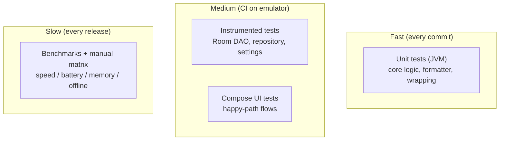

# Testing Strategy

## 1. Principles

- **Test the pure logic on the JVM**, fast and deterministic.
- **Test the Android integration on emulators/devices**, where behavior is
  real.
- **Benchmark on real hardware** for NFRs (speed, battery, memory) — see
  `docs/NFR.md`.
- Every commit must pass: `./gradlew test` and `./gradlew lintDebug`.

## 2. Test pyramid



## 3. Unit tests (JVM, `app/src/test/`)

Target everything in `core/` that is pure Kotlin:

| Area | Example test |
|------|--------------|
| `TranscriptFormatter` | Paragraph break on > 2 s pause (done: `TranscriptFormatterTest`) |
| `AndroidPdfExporter.wrapText` | Word wrap respects max width; paragraphs preserved |
| Model mapping (`toDomain`/`toEntity`) | Round-trip session entity ↔ domain |

Guidelines: no Android framework, no Robolectric for pure code, use
`kotlinx-coroutines-test` where suspend flows are involved.

## 4. Instrumented tests (`app/src/androidTest/`, device/emulator)

| Area | What to cover |
|------|---------------|
| App boot smoke | target context resolves (done: `ExampleInstrumentedTest`) |
| Room DAO | insert → observeAll order, observeById, update, deleteById |
| SessionRepository | full CRUD against an in-memory Room DB |
| SettingsRepository | persist model/language across recreation |
| Compose UI | record button state changes; sessions list renders; edit field saves |

**Running them in CI.** Our APK is **`arm64-v8a`-only** (release size), so a
standard x86_64 GitHub-hosted emulator **cannot install it**. Real-device
coverage runs via **`.github/workflows/firebase-test-lab.yml`**, which pushes
`assembleDebug` + `assembleAndroidTest` to **Firebase Test Lab physical
(arm64)** Pixels (Pixel 6/7/8) and fails the job on any failing execution.
The job is a **no-op (skipped)** when the Firebase secrets aren't configured,
so forks without a project stay green. To enable it, see
`docs/SETUP.md §8`. (Free Spark tier: ~5 physical runs/day.)

## 5. Manual test matrix (every release)

See the reference devices in `docs/NFR.md`. Script per device:

1. Airplane mode on → full happy path (record → transcribe → edit → export PDF)
   must work.
2. Import an MP3 and an OGG file → transcribe.
3. Export PDF → open in a PDF reader → print on 3 common printers (basic,
   inkjet, laser) — check margins, font size, page breaks (PRD risk).
4. Low-RAM emulator → confirm "requires 4 GB" gate, no crash.
5. Battery: 30-min record + transcribe session → ≤ 15% drain.
6. 10-min transcription benchmark per model size → ≤ 1.5× real-time for
   `base`.

## 6. Fuzz / edge cases worth automating later

- Empty transcript → export must still produce a valid 1-page PDF.
- Very long transcript (90-min lecture) → page count and memory are sane.
- Audio file with no audio track → graceful error, session marked `ERROR`.
- Rapid double-tap on stop/record → no `MediaRecorder` state crash.
- App killed mid-transcription → session left in `TRANSCRIBING`; recover or
  mark `ERROR` on next launch.

## 7. Running

```bash
./gradlew test                      # JVM unit tests
./gradlew lintDebug                 # lint
./gradlew connectedDebugAndroidTest # instrumented (needs emulator/device)
```
